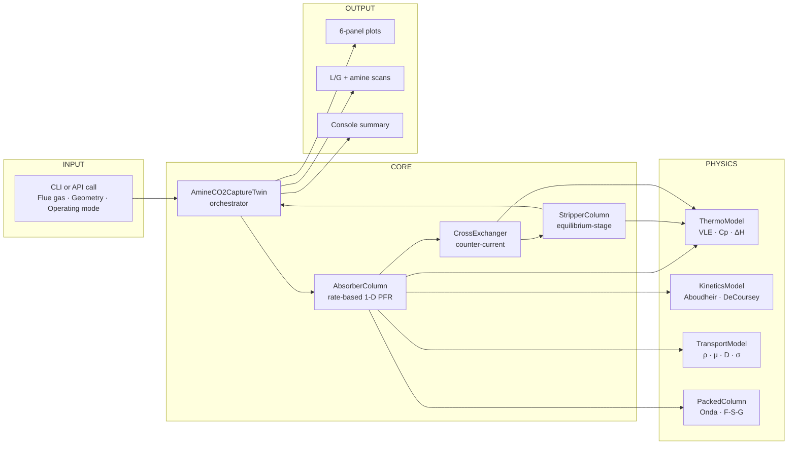

# Architecture

This document describes the internal architecture of the amine-wash CO₂ capture digital twin: the modules, their responsibilities, and how data flows between them. It is intended for readers who want to extend the model — add a new amine, change the column hydrodynamics, swap the VLE correlation, or wire in real-time data feeds.

---

## High-level data flow



---

## Module index

The script is a single self-contained file `amine_co2_capture.py` (~1,450 lines), organized in 12 sections. Each major class lives in its own section.

| Section | Class / Function           | Responsibility                                                                                       |
| :-----: | :------------------------- | :--------------------------------------------------------------------------------------------------- |
| 1       | constants & `AMINE_DB`, `PACKING_DB`, `DEFAULT` | Universal constants, solvent properties (MW, ρ, pKa, ΔH, Aboudheir kinetic parameters), packing database (Onda/Pall/Mellapak), default industrial operating envelope |
| 2       | `ThermoModel`              | VLE: P_CO₂ as function of (α, T) for each amine; H₂O saturation pressure (Antoine); solvent Cp (mass-fraction mixing); ΔH_absorption with loading correction |
| 3       | `KineticsModel`            | Aboudheir 2003 second-order k₂; Hatta number; DeCoursey 1974 enhancement factor; instantaneous-reaction limit E_∞ |
| 4       | `TransportModel`           | Liquid-phase ρ, μ (Weiland 1998), σ; CO₂ diffusivity (Stokes-Einstein + N₂O analogy); amine diffusivity (Wilke-Chang) |
| 5       | `PackedColumn`             | Onda 1968 correlations: liquid-film k_L, gas-film k_G, wetted area; Fuller-Schettler-Giddings gas-phase D; flue-gas ρ, μ |
| 6       | `AbsorberColumn`           | 1-D rate-based PFR with two-film mass transfer; shooting-method BVP solver (gas flows up, liquid flows down); coupled energy balance |
| 7       | `StripperColumn`           | Equilibrium-stage with linear interpolation of α and T; stage-wise VLE; reboiler-duty decomposition (reaction / latent / sensible) |
| 8       | `CrossExchanger`           | Counter-current HX with given hot-end approach temperature; computes lean and rich outlet temperatures |
| 9       | `AmineCO2CaptureTwin`      | Top-level orchestrator: solves absorber → HX → stripper in sequence; computes plant-wide KPIs |
| 10      | `plot_full_results`        | 6-panel figure: absorber profiles (T, composition, driving force) + stripper profile (T, α, vapor) + reboiler duty breakdown |
| 11      | `sensitivity_LG_scan`<br/>`amine_comparison` | L/G ratio scan and side-by-side comparison of MEA/DEA/MDEA/PZ |
| 12      | `default_run`              | Industrial 600 MW coal-plant case study with sensible defaults |

---

## Absorber model (Section 6)

The absorber is the most complex unit. Its state vector along the axial coordinate $z$ (measured from the bottom) is 4-dimensional:

$$\mathbf{y}(z) = \big[\, F_{\text{CO}_2,\text{gas}},\; F_{\text{CO}_2,\text{liq}},\; T_{\text{gas}},\; T_{\text{liq}} \,\big]$$

with $F_{\text{inert,gas}}$ (= N₂ + O₂ + H₂O) and $F_{\text{amine}}$ held constant (no significant gas-phase reaction; non-volatile amine).

### ODE right-hand side

```python
def rhs(z, y):
    F_CO2_gas, F_CO2_liq, T_gas, T_liq = y
    
    # 1. Local state — compute every transport, kinetic, and thermodynamic
    #    quantity at this z, given gas and liquid local conditions
    st = self._local_state(...)
    N_CO2  = st['N_CO2']      # mol/(m³·s) — volumetric absorption rate
    Q_rxn  = st['Q_rxn']      # J/(m³·s) — volumetric heat release
    
    # 2. Species balance: counter-current flow
    #    Gas flows UP (+z): loses CO2 as z increases (toward top)
    #    Liquid flows DOWN (-z): looks "younger" as z increases
    #    → both have negative dF/dz
    molar_rate = N_CO2 * self.A     # mol/(s·m)
    dFCO2_gas_dz = -molar_rate
    dFCO2_liq_dz = -molar_rate
    
    # 3. Energy balance: 10/90 split (gas/liquid)
    Q_per_z = Q_rxn * self.A        # J/(s·m)
    dT_gas_dz = +0.10 * Q_per_z / (F_total_gas * Cp_g)
    dT_liq_dz = -0.90 * Q_per_z / (m_L * cp_L)    # liquid heats going down
    
    return [dFCO2_gas_dz, dFCO2_liq_dz, dT_gas_dz, dT_liq_dz]
```

### Two-film mass-transfer overall coefficient

At each $z$, the local CO₂ flux is

$$N_{\text{CO}_2} = K_G \cdot a_w \cdot (P_{\text{CO}_2,\text{bulk}} - P_{\text{CO}_2,\text{eq}})$$

with the overall coefficient

$$\frac{1}{K_G \cdot a_w} = \underbrace{\frac{1}{k_G \cdot a_w}}_{\text{gas film}} + \underbrace{\frac{H_{\text{CO}_2}}{E \cdot k_L \cdot a_w \cdot R T}}_{\text{liquid film with reaction enhancement}}$$

where $E$ is the DeCoursey (1974) enhancement factor accounting for the consumption of CO₂ by reaction in the diffusion film. For industrial MEA at typical operating conditions, $E \approx 5\text{-}20$.

### Boundary-value problem and shooting method

The absorber is a **two-point boundary-value problem** because gas and liquid flow in opposite directions:
* At $z=0$ (bottom): gas conditions are *known* (flue-gas inlet); liquid conditions are *unknown* (rich amine exit)
* At $z=H$ (top): liquid conditions are *known* (lean amine inlet); gas conditions are *unknown* (treated gas exit)

The solver uses an iterative shooting method:
1. Guess the rich-amine state at $z=0$ (CO₂ flow + temperature)
2. Integrate upward to $z=H$
3. Compare the computed lean-amine state at $z=H$ with the known inlet
4. Update the bottom guess and re-integrate

The default geometry converges in 5-8 iterations to tolerance $|\Delta\alpha_{\text{top}}| < 10^{-3}$.

---

## Stripper model (Section 7)

The stripper uses the standard equilibrium-stage approximation with three simplifications well-justified for first-pass design:

1. **Linear profiles**: α decreases linearly from rich (top, stage 0) to lean (bottom, stage $N-1$); T increases linearly from $T_{\text{rich,after-HX}}$ at the top to $T_{\text{reb}}$ at the bottom. The stripper is well-mixed enough that these linear approximations capture the main physics; deviations from linearity are second-order.

2. **Bottom-stage equilibrium**: at each stage, the local vapor is in equilibrium with the local liquid: $P_{\text{CO}_2}(α, T)$ and $P_{\text{H}_2\text{O}}(α, T)$ are both at their equilibrium values.

3. **Top-vapor closure**: the reboiler duty for steam generation is set by the **net water leaving the top** (everything else is internal reflux). This is the energy-conserving choice that gives industry-realistic Q_specific.

### Reboiler duty decomposition

The total reboiler duty is the sum of three contributions:

$$Q_{\text{reb}} = Q_{\text{rxn}} + Q_{\text{vap}} + Q_{\text{sens}}$$

* **Reaction (desorption) heat**:  $Q_{\text{rxn}} = (-\Delta H_{\text{abs}}) \cdot \dot{n}_{\text{CO}_2,\text{cycled}}$
* **Latent heat of stripping steam**:  $Q_{\text{vap}} = \Delta H_{\text{vap,H}_2\text{O}} \cdot \dot{n}_{\text{H}_2\text{O,top}}$
* **Sensible heating**:  $Q_{\text{sens}} = \dot{m}_{\text{solv}} \cdot c_p \cdot (T_{\text{reb}} - T_{\text{rich,after-HX}})$

For the default case the breakdown is 54 / 21 / 25 % — within the typical industrial range of 50 / 30 / 20 %.

---

## Outer-loop convergence (Section 9)

The original design assumed an iterative loop where the absorber's lean inlet is set by the stripper's lean outlet, requiring outer iteration. After analysis, the model was reformulated to use **α_lean as a design input** — this is industrially correct, as the lean loading is a chosen operating point (not an emergent property).

The current orchestrator therefore solves the loop **one-shot**:

```python
1. alpha_lean = user-specified (e.g. 0.22)
2. abs_prof = absorber.solve(alpha_lean) → α_rich, capture_fraction, T_rich
3. hx       = cross_HX(T_lean=T_reb, T_rich=T_rich)
4. strip_prof = stripper.solve(α_rich, α_lean) → Q_reb required
5. Return KPIs
```

This is much faster and matches industrial design practice: the engineer chooses α_lean (typically 0.18-0.25 for MEA), then computes the reboiler duty required to deliver it.

---

## How to extend

### Add a new amine solvent

1. Add an entry to `AMINE_DB` with: MW, ρ_pure, pKa, ΔH_abs, cp_pure, k₂_pre, k₂_Ea, D_CO2_water_25.
2. If VLE differs substantially from MEA, extend `ThermoModel.pCO2_generic` with an amine-specific scaling factor or a separate correlation.
3. Validate against published equilibrium data (Jou-Mather-Otto type publications) and pilot-plant runs.

### Replace VLE correlation with electrolyte NRTL

The current VLE uses a simple 4-parameter Posey-Tapperson-style fit:
$$\ln(P_{\text{CO}_2}/\text{Pa}) = A + B/T + C\alpha + D\alpha^2/T$$

For higher accuracy (especially at very high or very low loadings), replace `pCO2_aronu_MEA` with an electrolyte-NRTL implementation. Standard references: Aronu et al. (2011), Hessen-Haug-Bjørnstad (2013), or use a wrapper around the `chemicals` Python library.

The kinetic and transport sub-models all consume VLE only via `pCO2_generic`, so substitution is straightforward.

### Add absorber inter-cooling

Industrial designs often use a split-flow absorber with intercoolers at one or two intermediate heights, reducing the absorption-heat bulge that limits capture rate. To add intercooling:

1. Modify `AbsorberColumn.solve` to break the integration into segments separated by an inter-cooler.
2. At each intercooler, compute the liquid heat removed: $Q_{\text{ic}} = \dot{m}_L \cdot c_p \cdot (T_{\text{out}} - T_{\text{ic,target}})$.
3. The total absorption capacity will improve by ~10-15 % at the same column height.

### Wire in real-time data

The script can be turned into a true online digital twin by:
1. Replacing `default_run` with a function that reads live flue-gas composition (analyzer), L (FT), T's (TT's) from an OPC-UA / MQTT server.
2. Solving each minute → output predicted capture rate, alpha-rich estimate.
3. Comparing model α_rich vs in-line refractometer or density-based α measurement → adaptive bias correction.

---

## Numerical settings

* **Absorber solver**: `scipy.integrate.solve_ivp(method='LSODA')` — adaptive stiff/non-stiff; required because the ODE is mildly stiff at the top of the column where the driving force collapses.
* **Tolerances**: rtol = 10⁻⁶, atol = 10⁻⁹.
* **Shooting iteration**: damping factor 1.0 on liquid CO₂; 0.3 on liquid T; tolerance $|\Delta\alpha| < 10^{-3}$; max 15 iterations.
* **VLE inversion**: `brentq` with bounds α ∈ [10⁻⁵, 0.65].
* **Stripper top-T closure**: `brentq` to find T_top where $P_{\text{CO}_2}(α_{\text{rich}}, T) + P_{\text{H}_2\text{O}}(T) = P_{\text{strip}}$.

---

## Performance

A typical industrial-scale single run (18 m × 8 m absorber, 8-stage stripper, 30 wt% MEA, L/G = 4.0) completes in:

* ~1 s for one default-case solve
* ~10 s for a full 7-point L/G scan
* ~5 s for the 4-amine comparison

All on a modest laptop, single-threaded. No GPU or parallelism required.
