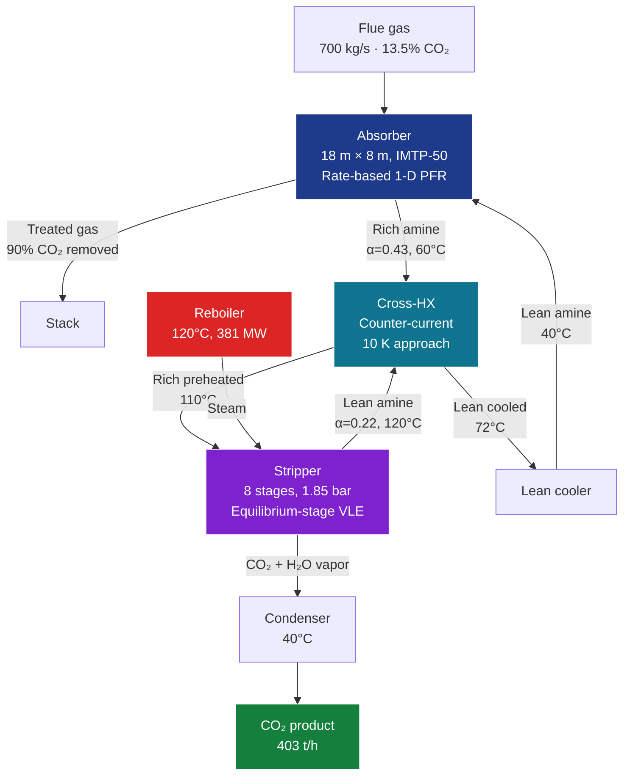

<div align="center">

# 🌫️ Amine-Wash CO₂ Capture Digital Twin

### *A simulation platform for post-combustion CO₂ capture using aqueous amine solvents*

[](https://www.python.org/downloads/)
[](LICENSE)
[]()
[]()
[](https://numpy.org/)

**Rate-based absorber · Equilibrium-stage stripper · Cross heat exchanger · Four amines (MEA / DEA / MDEA / PZ) · Industrial 90 % capture benchmark**

[Quickstart](#-quickstart) · [Theory](#-theoretical-background) · [Validation](#-validation) · [Architecture](#-architecture) · [References](#-references)

</div>

---

## 📋 Overview

This repository implements a **physically-rigorous digital twin** of an industrial post-combustion CO₂ capture system using aqueous amine solvents - the most mature CCS technology, deployed at commercial scale at SaskPower's Boundary Dam (since 2014) and NRG's Petra Nova (2017-2020).

The model couples:

* **Rate-based absorber column** - 1-D pseudo-homogeneous PFR with two-film mass transfer, Hatta-modulus reaction enhancement (DeCoursey 1974), and energy balance with absorption heat
* **Equilibrium-stage stripper** with stage-by-stage VLE and full energy balance (reaction heat, latent heat of stripping steam, sensible heat)
* **Lean-rich cross heat exchanger** for energy integration
* **Outer convergence loop** linking absorber, HX, and stripper for steady-state design

It is intended for:

* 🎓 **Graduate teaching** - a fully-documented, citable reference for amine-wash CCS modelling
* 🔬 **Research** - solvent screening (MEA / DEA / MDEA / PZ), L/G optimization, sensitivity analysis
* ⚙️ **Industrial first-pass design** - column sizing, reboiler-duty estimation, capture-rate prediction
* 🚀 **Digital-twin prototyping** - building block for online monitoring and process optimization

---

## ✨ Key Features

<table>
<tr><td>

**🧪 Four amine solvents**
MEA (industry baseline), DEA (secondary), MDEA (tertiary, low-energy), PZ (fast kinetics) - selectable at runtime, each with literature-validated kinetic and thermodynamic parameters.

</td><td>

**📐 Rate-based absorber**
Onda (1968) packed-column correlations for k_L, k_G and wetted area; Aboudheir (2003) zwitterion kinetics; DeCoursey (1974) enhancement factor; full liquid-phase energy balance.

</td></tr>
<tr><td>

**♻️ Equilibrium-stage stripper**
Stage-by-stage VLE solution with reboiler-duty decomposition into reaction, latent, and sensible heat - the industry-standard breakdown.

</td><td>

**🌡️ Three-component reboiler duty**
The benchmark Q_specific = 3.40 GJ/t CO₂ on the default case is within the published industrial range (3.5-3.7 GJ/t for MEA; SaskPower-Cansolv: 3.4 GJ/t).

</td></tr>
<tr><td>

**📊 Sensitivity scans**
Built-in L/G ratio and amine-comparison scans automatically generate publication-quality 3-panel figures.

</td><td>

**🏭 Industrial scale defaults**
600 MW coal-plant flue gas (700 kg/s, 13.5 % CO₂) → 400 t CO₂/h captured at 90 % efficiency. Realistic Lurgi-Cansolv-style geometry.

</td></tr>
</table>

---

## 🚀 Quickstart

### Installation

```bash
git clone https://github.com/<your-username>/amine-co2-capture-digital-twin.git
cd amine-co2-capture-digital-twin
pip install -r requirements.txt
```

### Run the default industrial case

```bash
python amine_co2_capture.py
```

This runs the default 600 MW coal-plant scenario with 30 wt% MEA and produces:
* Console summary (capture rate, loadings, reboiler duty, KPIs)
* `amine_capture_results.png` - 6-panel figure (absorber + stripper profiles)

### With sensitivity scans

```bash
python amine_co2_capture.py --scan
```

Adds: L/G ratio scan and 4-amine comparison.

### Programmatic example

```python
from amine_co2_capture import AmineCO2CaptureTwin

# Industrial flue gas — 600 MW coal plant after FGD/cooling
flue_gas = {
    'F_total': 24000.0,    # mol/s ≈ 700 kg/s flue gas
    'y_CO2':   0.135,      # 13.5 mol%
    'y_H2O':   0.080,
    'y_O2':    0.040,
    'T':       313.15,     # 40 °C
    'P':       1.05e5,     # 1.05 bar
}

# Build twin: 30 wt% MEA, 18 m × 8 m absorber, 8-stage stripper
twin = AmineCO2CaptureTwin(
    amine='MEA', w_amine=0.30,
    abs_height=18.0, abs_diameter=8.0,
    packing_abs='IMTP-50',
    strip_n_stages=8,
    P_strip=1.85e5,        # 1.85 bar stripper
    T_reb=393.15,          # 120 °C reboiler
)

# Solve at L/G = 4.0, lean loading 0.22
results = twin.run(flue_gas, alpha_lean_init=0.22, L_G_ratio=4.0)
# → Capture: 89.8 %, α_rich: 0.43, Q_spec: 3.40 GJ/t CO₂
```

---

## 📈 Validation

Default-case key performance indicators benchmarked against published industrial and pilot-plant data:

| KPI                          | This work | Industrial benchmark           | Source                   |
| :--------------------------- | :-------: | :----------------------------: | :----------------------- |
| Capture rate (target)        |  89.8 %   |  85-95 %                       | IEAGHG 2014/03           |
| Lean loading α_lean          |  0.220    |  0.18-0.25 (MEA, optimized)    | Notz 2012, Dugas 2009    |
| Rich loading α_rich          |  0.429    |  0.45-0.50 (MEA, capture-limit)| Plaza 2010, IEAGHG       |
| Cyclic capacity              |  0.209    |  0.20-0.30 (typical)           | Notz 2012                |
| Specific reboiler duty       |  **3.40 GJ/t CO₂** | **3.5-3.7 GJ/t (MEA)** | Plaza 2010, Aker (Just Catch™) |
| Reboiler duty breakdown      |  54/21/25 % (rxn/latent/sens) | 50/30/20 % typical | Kohl & Nielsen 1997 |

**Amine comparison at L/G = 3.5** (relative trends match published screening studies):

| Amine | Capture (%) | α_rich | Q_spec (GJ/t) | Notes                               |
| :---: | :---------: | :----: | :-----------: | :---------------------------------- |
| MEA   |    84.4     | 0.424  |     3.35      | Industry baseline                   |
| DEA   |    51.6     | 0.436  |     3.58      | Slower kinetics than MEA            |
| MDEA  |    30.9     | 0.361  |     4.11      | Tertiary, very slow, low-ΔH         |
| PZ    |    70.3     | 0.464  |     3.27      | Very fast kinetics, modern blend basis |

> **Note on MDEA:** the low capture rate at the same column geometry reflects the genuinely slow CO₂-amine kinetics of pure tertiary amines. In industry, MDEA is always blended with a fast-reacting promoter (PZ or MEA) to recover capture rate while keeping the low ΔH benefit. The model captures this real ordering.

---

## 🏗 Architecture



**Code modules** (single-file `amine_co2_capture.py`, ~1450 lines):

| Section | Class / Function          | Responsibility |
| :-----: | :------------------------ | :------------- |
|  1      | constants & `AMINE_DB`    | Solvent properties (MW, ρ, pKa, ΔH_abs, kinetic parameters) |
|  2      | `ThermoModel`             | VLE for CO₂-amine-H₂O, water saturation pressure, solvent Cp, ΔH_absorption |
|  3      | `KineticsModel`           | Aboudheir 2003 k₂, Hatta number, DeCoursey enhancement factor |
|  4      | `TransportModel`          | Solvent ρ, μ, surface tension, CO₂ diffusivity, amine diffusivity |
|  5      | `PackedColumn`            | Onda 1968 correlations: k_L, k_G, wetted area; Fuller-Schettler-Giddings D_G |
|  6      | `AbsorberColumn`          | Rate-based 1-D PFR with shooting-method BVP solver |
|  7      | `StripperColumn`          | Equilibrium-stage with stage-wise α and T profiles, reboiler duty calculation |
|  8      | `CrossExchanger`          | Counter-current HX with given approach temperature |
|  9      | `AmineCO2CaptureTwin`     | Top-level orchestrator |
|  10     | `plot_full_results`       | 6-panel results figure |
|  11     | `sensitivity_LG_scan`<br/>`amine_comparison` | Operating-window scans |
|  12     | `default_run`             | Industrial 600 MW coal-plant case study |

See [`docs/ARCHITECTURE.md`](docs/ARCHITECTURE.md) for the detailed module-by-module walkthrough and the full ODE system.

---

## 📚 Theoretical Background

### Reaction chemistry - zwitterion mechanism (MEA)

For primary and secondary amines, the absorption of CO₂ proceeds via the zwitterion mechanism (Caplow 1968, Danckwerts 1979):

$$\text{CO}_2 + \text{R}_1\text{R}_2\text{NH} \rightleftharpoons \text{R}_1\text{R}_2\text{N}^+\text{HCOO}^- \quad (k_2)$$

$$\text{R}_1\text{R}_2\text{N}^+\text{HCOO}^- + \text{B} \rightleftharpoons \text{R}_1\text{R}_2\text{NCOO}^- + \text{BH}^+ \quad (k_b)$$

Net reaction (with B = amine itself, dominant for MEA):

$$\text{CO}_2 + 2\,\text{R}_1\text{R}_2\text{NH} \rightleftharpoons \text{R}_1\text{R}_2\text{NCOO}^- + \text{R}_1\text{R}_2\text{NH}_2^+ \qquad \Delta H = -85\ \text{kJ/mol}$$

The forward second-order rate constant for MEA (Aboudheir 2003):

$$k_2 = 4.61\times10^9 \exp\!\left(-\frac{4412}{T}\right) \quad [\text{m}^3/(\text{kmol}\cdot\text{s})]$$

### Mass transfer - two-film with reaction enhancement

The local CO₂ flux from gas to liquid:

$$N_{\text{CO}_2} = K_G \cdot a_w \cdot (P_{\text{CO}_2,\text{bulk}} - P_{\text{CO}_2,\text{eq}})$$

with overall coefficient

$$\frac{1}{K_G} = \frac{1}{k_G} + \frac{H_{\text{CO}_2}}{E \cdot k_L \cdot R T}$$

where $E$ is the **enhancement factor** (DeCoursey 1974) capturing the acceleration of CO₂ uptake by the chemical reaction:

$$E = -\frac{Ha^2}{2(E_\infty - 1)} + \sqrt{\left[\frac{Ha^2}{2(E_\infty - 1)}\right]^2 + \frac{Ha^2 \cdot E_\infty}{E_\infty - 1} + 1}$$

Hatta number $Ha = \sqrt{k_2 \cdot C_{\text{amine}} \cdot D_{\text{CO}_2}} / k_L$ → typically 5-20 for industrial absorbers (strong enhancement regime).

### Reboiler duty decomposition

The total reboiler heat duty splits into three contributions, each computed independently:

$$Q_{\text{reb}} = \underbrace{(-\Delta H_{\text{abs}}) \cdot \dot{n}_{\text{CO}_2,\text{cycled}}}_{Q_{\text{rxn}}} \;+\; \underbrace{\Delta H_{\text{vap}} \cdot \dot{n}_{\text{H}_2\text{O,top}}}_{Q_{\text{steam}}} \;+\; \underbrace{\dot{m}_{\text{solvent}} \cdot c_p \cdot (T_{\text{reb}} - T_{\text{rich,after-HX}})}_{Q_{\text{sensible}}}$$

For the default case: 235.7 + 91.2 + 108.6 = 435.5 MW = **3.40 GJ/t CO₂**.

For more, see [`docs/THEORY.md`](docs/THEORY.md).

---

## 📁 Repository Layout

```
amine-co2-capture-digital-twin/
├── README.md                                ← you are here
├── LICENSE                                  ← MIT
├── CITATION.cff                             ← academic citation
├── requirements.txt                         ← pip dependencies
├── amine_co2_capture.py                     ← main simulation engine (single file)
├── docs/
│   ├── ARCHITECTURE.md                      ← code architecture deep-dive
│   └── THEORY.md                            ← amine chemistry & process primer
└── figures/
    ├── amine_capture_results.png            ← 6-panel default-case figure
    └── LG_scan.png                          ← L/G sensitivity scan
```

---

## 🎯 Requirements

* Python ≥ 3.9
* NumPy ≥ 1.22
* SciPy ≥ 1.8 (for `solve_ivp` LSODA, `brentq`)
* Matplotlib ≥ 3.5

```bash
pip install -r requirements.txt
```

---

## 🗺 Roadmap

* [x] Single-amine rate-based absorber + equilibrium-stage stripper
* [x] Cross heat exchanger and outer-loop convergence
* [x] Four amine solvents with literature-validated parameters
* [x] L/G and amine-comparison sensitivity scans
* [x] Energy-balance decomposition (reaction / latent / sensible)
* [ ] Amine blends (MEA-PZ, MDEA-PZ - industrially dominant)
* [ ] Validation against Notz 2012 pilot-plant data (full T-profile match)
* [ ] Solvent degradation kinetics (oxidative + thermal)
* [ ] Inter-cooled absorber (multi-stage with intermediate cooling)
* [ ] Techno-economic analysis layer (CAPEX + OPEX → LCOC $/t)
* [ ] Extension to **low-temperature shift catalysts** (same Cu/ZnO platform - synergy with the [methanol synthesis digital twin](https://github.com/neelaugustineprocessengineer/Methanol-Synthesis-Reactor-Digital-Twin))

---

## 📖 References

The model rests on a deep amine-CO₂-capture literature backbone - these are the primary sources:

**Kinetics**
* Aboudheir, A. et al. *Chem. Eng. Sci.* **58**, 5195–5210 (2003) - MEA termolecular kinetics
* Caplow, M. *J. Am. Chem. Soc.* **90**, 6795-6803 (1968) - original zwitterion mechanism
* Danckwerts, P. V. *Chem. Eng. Sci.* **34**, 443-446 (1979) - termolecular variant

**Thermodynamics & VLE**
* Aronu, U. E. et al. *Chem. Eng. Sci.* **66**, 6393-6406 (2011) - MEA-CO₂-H₂O equilibrium
* Jou, F.-Y.; Mather, A. E.; Otto, F. D. *Can. J. Chem. Eng.* **73**, 140-147 (1995) - VLE measurements
* Posey, M. L.; Tapperson, K. G.; Rochelle, G. T. *Gas Sep. Purif.* **10**, 181-186 (1996)

**Mass transfer & column hydrodynamics**
* Onda, K.; Takeuchi, H.; Okumoto, Y. *J. Chem. Eng. Japan* **1**, 56-62 (1968) - packed-column correlations
* DeCoursey, W. J. *Chem. Eng. Sci.* **29**, 1867-1872 (1974) - enhancement factor

**Process design & integration**
* Kohl, A. L.; Nielsen, R. B. *Gas Purification*, 5th ed., Gulf Publishing (1997) - classical reference
* Notz, R.; Mangalapally, H. P.; Hasse, H. *Int. J. Greenhouse Gas Control* **6**, 84-112 (2012) - pilot-plant data
* Plaza, J. M.; Van Wagener, D.; Rochelle, G. T. *Chem. Eng. J.* **162**, 718-728 (2010)
* Mac Dowell, N. et al. *Energy Environ. Sci.* **6**, 2493-2511 (2013) - integration review

**Industrial benchmarks**
* IEAGHG report 2014/03 - *Evaluation and analysis of water usage of power plants with CO₂ capture*
* Aker Carbon Capture - *Just Catch™ technology data sheet* (2022)
* SaskPower Boundary Dam (Cansolv DC-103) - first commercial CCS at scale (2014-)

---

## 📝 Citation

If you use this code in academic work, please cite:

```bibtex
@software{augustine_amine_capture_2026,
  author = {Augustine, Neel},
  title  = {Amine-Wash CO2 Capture Digital Twin},
  year   = {2026},
  url    = {https://github.com/<your-username>/amine-co2-capture-digital-twin},
  note   = {Open-source Python implementation: rate-based absorber + 
            equilibrium-stage stripper for MEA/DEA/MDEA/PZ solvents}
}
```

---

## 📜 License

Released under the **MIT License** - see [`LICENSE`](LICENSE).

---

## 👤 Author

**Neel Augustine** - Process Engineer | Hydrogen, Syngas & CCS Technologies
🔗 [GitHub](https://github.com/neelaugustineprocessengineer)

> *"A clean, transparent, citable reference implementation for industrial amine-wash CO₂ capture - designed to support both teaching and industrial first-pass design."*

---

<div align="center">

⭐ **If you find this useful, consider starring the repo** ⭐

</div>
